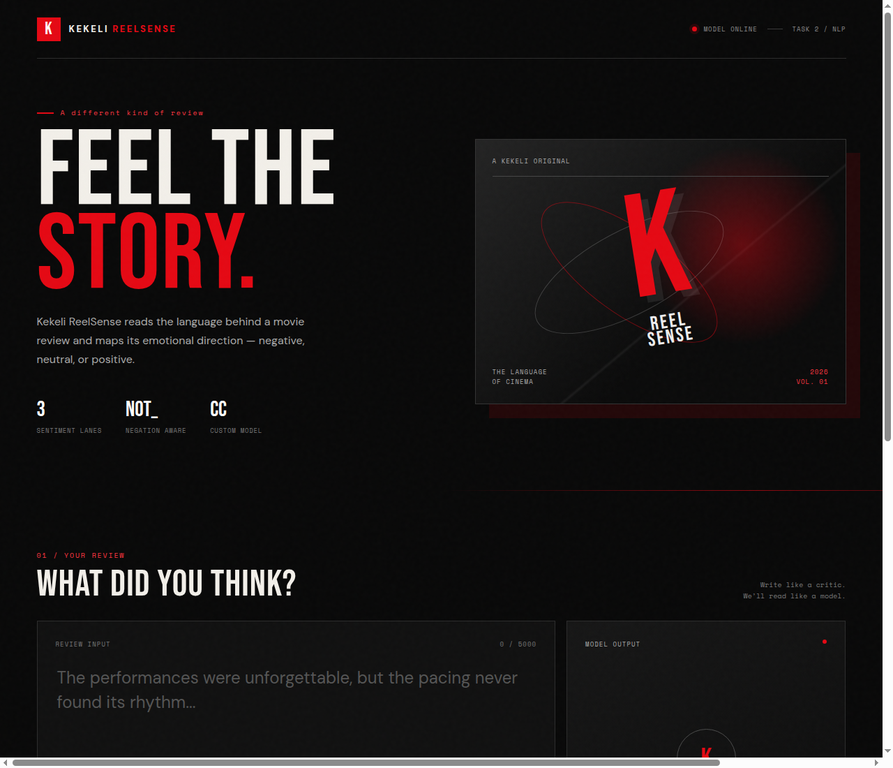

# Kekeli ReelSense — Movie Review Sentiment Website



**Live website:** [Open Kekeli ReelSense](https://Wizzy-pixel-ui.github.io/Kekeli_ReelSense_Movie_Review_Website/)

Kekeli ReelSense is the Task 2 movie-review sentiment project presented as a cinematic web experience. It uses the **Negation-Aware Contrastive Centroid Classification** model created for the Daryl Tech & Educational Network AI and Machine Learning internship.

## What Task 2 asks for

Task 2 asks the student to perform sentiment analysis on text data. The work includes selecting a movie-review dataset, cleaning and tokenizing the text, handling stopwords, converting text into TF-IDF features, assigning reviews to negative/neutral/positive classes, reporting evaluation metrics, and discussing limitations.

## What this project achieves

| Task 2 requirement | Achievement |
|---|---|
| Movie-review dataset | Uses the public SST-5 movie-review corpus from Hugging Face, with the Kaggle competition as the primary dataset reference |
| Three sentiment classes | Maps five-level labels into negative, neutral, and positive |
| Text cleaning | Removes unusable records and duplicate review-label pairs |
| Tokenization | Uses a custom word tokenizer |
| Negation handling | Preserves negation words and marks the next three meaningful terms with `NOT_` |
| Stopword processing | Removes ordinary English stopwords while keeping important negation words |
| TF-IDF features | Uses normalized unigrams and bigrams with sublinear TF scaling |
| Custom algorithm | Uses Negation-Aware Contrastive Centroid Classification |
| Explainability | Shows class scores, confidence, and the model’s language-processing idea |
| Website deployment | Provides a browser-based cinematic sentiment analyzer |
| Permanent hosting | Uses a self-contained static build suitable for GitHub Pages |

## Website features

- Netflix-inspired red-and-black cinematic design
- Custom Kekeli **K** logo
- “Kekeli ReelSense” project identity
- Review text input
- Positive, neutral, and negative example buttons
- Sentiment result card
- Confidence score
- Per-class score bars
- Negation-aware review processing
- Mobile-responsive layout
- Model explanation section

## Model approach

The classifier follows the Task 2 notebook design:

1. It maps SST-5 labels 0–1 to negative, label 2 to neutral, and labels 3–4 to positive.
2. It tokenizes reviews while preserving negation words such as `not`, `never`, and `no`.
3. It prefixes up to three nearby terms with `NOT_` after a negation signal.
4. It represents the processed review with TF-IDF unigrams and bigrams.
5. It learns a normalized centroid for each sentiment class.
6. It creates contrastive feature weights from the differences between class centroids.
7. It compares the review with each centroid using weighted cosine-style scores.
8. It routes low-margin predictions to neutral when the evidence is too close.

## Repository structure

```text
Kekeli_ReelSense_Movie_Review_Website/
├── README.md
├── docs/                         # Published GitHub Pages site
│   ├── index.html
│   ├── styles.css
│   └── model.json
├── preview/
│   └── website-preview.webp
└── source/                       # Original Flask implementation and training code
    ├── app.py
    ├── model_logic.py
    ├── train_model.py
    ├── requirements.txt
    ├── templates/
    └── static/
```

## Permanent website

The `docs/` folder is a self-contained browser build. It includes the trained TF-IDF vocabulary, IDF weights, centroids, feature weights, and neutral margin in `model.json`. The browser performs preprocessing and inference locally, so the published site does not depend on the temporary Flask preview service.

## Local Flask version

The `source/` folder preserves the server-based version used during development.

```bash
cd source
python -m venv .venv
source .venv/bin/activate
pip install -r requirements.txt
python app.py
```

The local Flask application runs on port `5050` and exposes `POST /predict`.

Example request:

```json
{
  "review": "The performances were unforgettable and the cinematography was stunning."
}
```

## Dataset links

- [Kaggle Sentiment Analysis on Movie Reviews](https://www.kaggle.com/c/sentiment-analysis-on-movie-reviews)
- [SST-5 dataset on Hugging Face](https://huggingface.co/datasets/SetFit/sst5)

## Limitations

TF-IDF and centroid comparison do not fully understand sarcasm, irony, long-range context, or complex cultural references. The five-level-to-three-level mapping removes some of the original sentiment detail. The website is an educational internship deployment and should not be treated as a definitive measure of a viewer’s opinion.

## Internship

**Daryl Tech & Educational Network — AI and Machine Learning Internship**  
**Task completed:** Task 2 — Sentiment Analysis on Text Data
